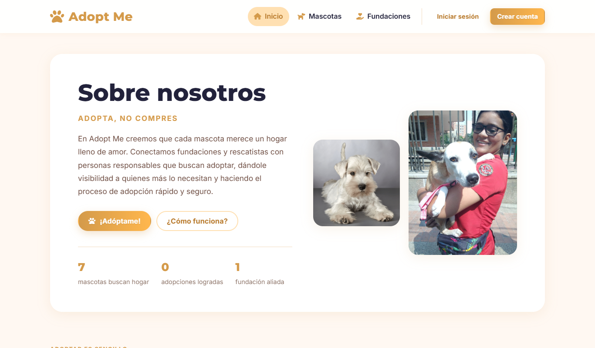
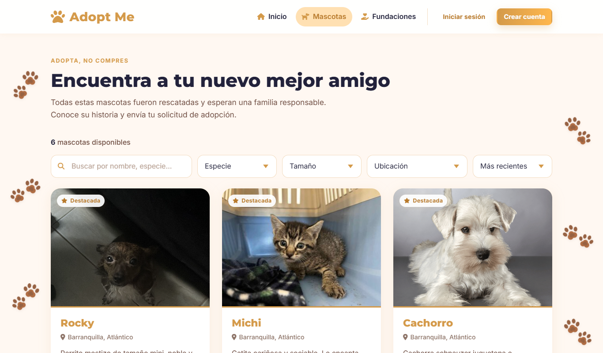
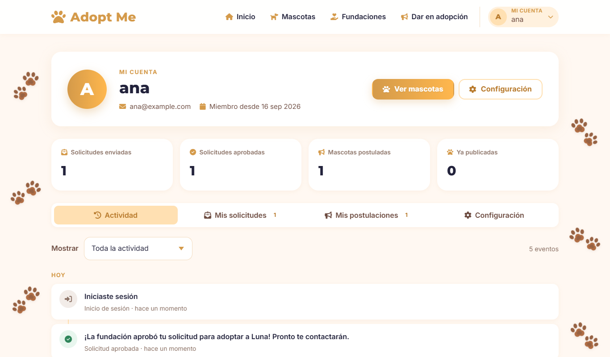
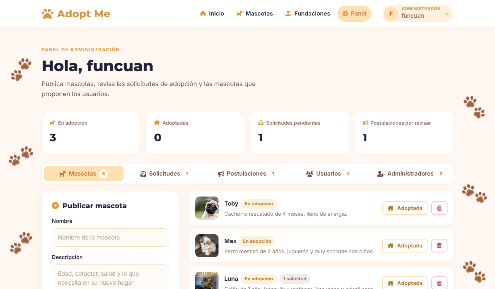
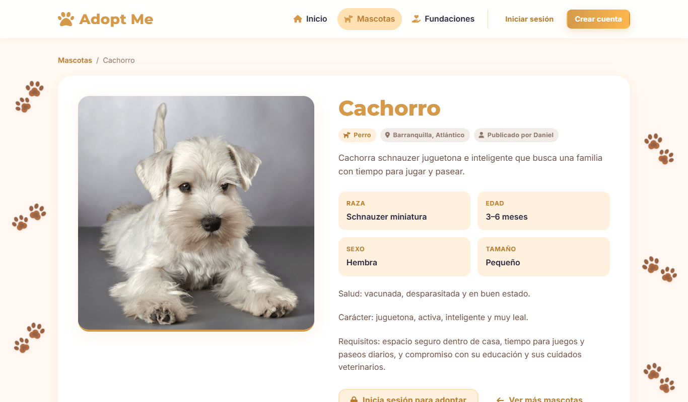
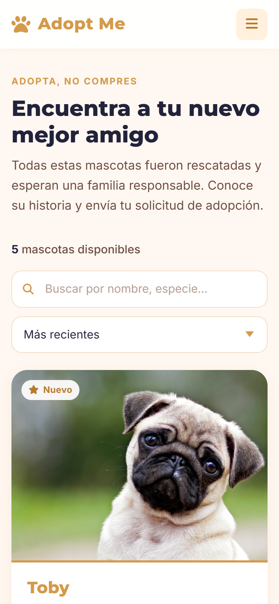
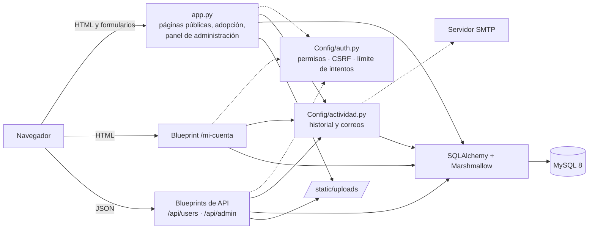
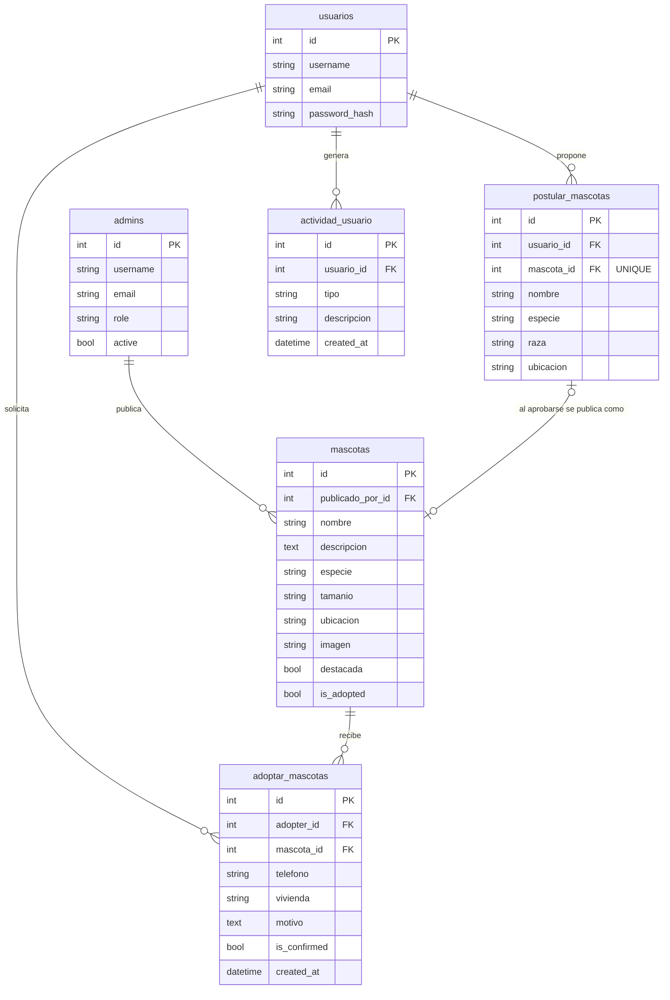

# 🐾 Adopt Me Now

**Plataforma web de adopción de mascotas que conecta fundaciones de rescate animal con personas que quieren adoptar.**

### 🔗 [Ver demo en vivo](https://adopt-me-now.up.railway.app)

[](https://github.com/IngGMunoz/Adopt-Me-Now/actions/workflows/tests.yml)


Las fundaciones publican las mascotas que tienen en adopción y revisan las solicitudes desde un panel propio. Los usuarios exploran el catálogo, envían solicitudes de adopción, proponen mascotas que necesitan hogar y siguen el estado de todo desde su cuenta, con un historial de actividad.

<p align="center">
  
  
  
  
</p>

<p align="center">
  
  
</p>

## Demo

La aplicación está desplegada en **[adopt-me-now.up.railway.app](https://adopt-me-now.up.railway.app)** (Railway: Docker + Gunicorn + MySQL).

Entra con una de estas cuentas de prueba (no se pueden modificar ni eliminar):

| Rol | Correo | Contraseña |
| --- | --- | --- |
| Fundación (panel de administración) | `fundacion@demo.com` | `DemoFundacion1` |
| Adoptante | `adoptante@demo.com` | `DemoAdoptante1` |

## Contenido

- [Demo](#demo)
- [Funcionalidades](#funcionalidades)
- [Stack](#stack)
- [Arquitectura](#arquitectura)
- [Modelo de datos](#modelo-de-datos)
- [Instalación](#instalación)
- [Tests](#tests)
- [Rutas y API](#rutas-y-api)
- [Seguridad](#seguridad)
- [Estructura del proyecto](#estructura-del-proyecto)
- [Limitaciones y próximos pasos](#limitaciones-y-próximos-pasos)

## Funcionalidades

### Para cualquier visitante
- **Catálogo de mascotas** con búsqueda, **filtros por especie, tamaño y ubicación** y ordenamiento, todo instantáneo. Las mascotas destacadas aparecen primero y las ya adoptadas se ocultan.
- **Ficha de cada mascota** con sus datos (raza, edad, sexo, tamaño), ubicación y descripción.
- **Página de la fundación aliada** con su información y enlace de contacto.
- **Asistente conversacional** (Landbot) que orienta sobre el proceso de adopción, dentro de un panel propio con la identidad de la app. Su script solo se descarga cuando el visitante abre el chat.

### Para usuarios registrados
- **Registro e inicio de sesión** con correo o nombre de usuario. Tras iniciar sesión, el usuario vuelve a la página en la que estaba.
- **Solicitud de adopción.** Es un formulario asociado a la mascota elegida, con los datos del usuario precargados y validación en el cliente y en el servidor.
- **Dar en adopción.** El usuario puede proponer una mascota (especie, raza, edad, sexo, tamaño, ubicación y foto) para que una fundación la revise y la publique.
- **Mi cuenta**, con cuatro secciones:
  - **Actividad:** historial agrupado por día y filtrable por tipo. Registra las acciones del usuario (registro, inicios de sesión, solicitudes, postulaciones, cambios de perfil y contraseña) y las decisiones de la fundación sobre ellas (solicitud aprobada, mascota publicada, postulación descartada).
  - **Mis solicitudes** y **Mis postulaciones**, cada una con su estado.
  - **Configuración:** editar el nombre de usuario y el correo, cambiar la contraseña y eliminar la cuenta.

### Para fundaciones (administradores)
- **Registro protegido.** Crear una cuenta de administrador exige un código de invitación definido en el servidor.
- **Panel de administración** con métricas (mascotas en adopción, adoptadas, solicitudes pendientes y postulaciones por revisar) y cinco pestañas:
  - **Mascotas:** publicar con foto, especie, tamaño, ubicación y otros datos; **destacar** o quitar el destacado (las destacadas encabezan el inicio y el catálogo), marcar como adoptada o eliminar.
  - **Solicitudes:** ver los datos del adoptante y aprobarlas. Al aprobar una, la mascota pasa a adoptada y sale del catálogo, y el adoptante recibe un **correo**.
  - **Postulaciones:** publicar en el catálogo las mascotas que proponen los usuarios, o descartarlas. En ambos casos el usuario recibe un **correo**.
  - **Usuarios:** listado con buscador, totales de solicitudes y postulaciones, y última actividad de cada usuario. Cada uno tiene una **ficha** con su historial, sus solicitudes y sus postulaciones, y desde ella se puede eliminar la cuenta.
  - **Administradores:** crear cuentas para otros miembros de la fundación, y desactivarlas, reactivarlas o eliminarlas. Ningún administrador puede desactivar ni eliminar su propia cuenta.

### Transversales
- **Interfaz responsive y accesible**, construida sobre un sistema de diseño propio (tokens de color y tipografía, componentes y macros de formulario Jinja2), sin frameworks de CSS ni de JavaScript. Incluye menú de usuario desplegable, pestañas con navegación por teclado, validación en línea y avisos no intrusivos.
- **API REST** en JSON para usuarios, administradores, mascotas, postulaciones y solicitudes.
- **Avisos por correo** (SMTP) cuando cambia el estado de una solicitud o postulación. Se envían en segundo plano para no demorar la respuesta.
- **Entorno reproducible** con Docker Compose (Gunicorn + MySQL con *healthcheck*).
- **68 tests automatizados** con pytest, ejecutados en GitHub Actions en cada *push*.

## Stack

| Capa | Tecnologías |
| --- | --- |
| Backend | Python 3.12, Flask 3.1 (Blueprints), Jinja2 |
| Datos | MySQL 8, SQLAlchemy 2 (ORM), Flask-SQLAlchemy, Marshmallow |
| Frontend | HTML5 semántico, CSS3 (custom properties, grid, flexbox), JavaScript sin dependencias, Font Awesome |
| Infraestructura | Docker, Docker Compose, Gunicorn, configuración por variables de entorno (`.env`) |
| Calidad | pytest, GitHub Actions |

## Arquitectura



El proyecto sigue un patrón MVC:

- **Modelos** (`Models/`): usuarios, administradores, mascotas, solicitudes de adopción, postulaciones y actividad. Los schemas de Marshmallow están en un módulo aparte (`Models/schemas.py`) para que todas las relaciones entre modelos estén resueltas al serializar.
- **Controladores**: `app.py` atiende las páginas; `Config/controller/` contiene los Blueprints de la API y el área "Mi cuenta".
- **Vistas** (`Config/Templates/`): un layout base, componentes reutilizables (navbar, footer, tarjetas, avisos, modal) y macros de formulario.

## Modelo de datos



**Flujo principal:**

1. Una **fundación** publica una **mascota**, o aprueba la **postulación** de un **usuario**. En ese caso la postulación queda enlazada a la mascota creada.
2. Un **usuario** envía una **solicitud de adopción** para una mascota.
3. La fundación **aprueba** la solicitud y la mascota pasa a adoptada.
4. Cada paso queda en la **actividad** del usuario involucrado.

**Integridad de los datos:**

- Las llaves foráneas de mascotas, solicitudes y postulaciones usan `ON DELETE SET NULL`. Si se elimina un usuario o una mascota, la fundación conserva el registro de sus procesos.
- La actividad pertenece al usuario y se elimina junto con su cuenta.
- Al iniciar, [`Config/schema.py`](Config/schema.py) crea las tablas que falten y migra de forma idempotente las bases MySQL de versiones anteriores. Agrega columnas, índices y llaves foráneas, y enlaza registros antiguos que guardaban nombres en texto. También genera el historial de los usuarios creados antes de que existiera la tabla de actividad, y carga una sola vez las mascotas destacadas iniciales ([`Config/catalogo.py`](Config/catalogo.py)). Después se gestionan desde el panel.

## Instalación

### 1. Configurar el entorno

La configuración se lee de un archivo `.env` en la raíz del proyecto, que Git no versiona. Créalo con este contenido y cambia los valores:

```ini
SECRET_KEY=una-clave-larga-y-aleatoria
ADMIN_REGISTRATION_CODE=codigo-para-registrar-fundaciones

DB_HOST=127.0.0.1
DB_PORT=3307
DB_USER=root
DB_PASSWORD=claveSegura123
DB_NAME=adoptme

PORT=5100
FLASK_DEBUG=false

# Opcional: correos de aviso (con Gmail, usa una contraseña de aplicación)
SMTP_HOST=smtp.gmail.com
SMTP_PORT=587
SMTP_USER=tu-correo@gmail.com
SMTP_PASSWORD=contraseña-de-aplicacion
SMTP_FROM=Adopt Me <tu-correo@gmail.com>
```

> - Usa solo letras, números y guiones en `DB_PASSWORD`: PyMySQL no autentica contraseñas con tildes o con la letra ñ.
> - Para generar una `SECRET_KEY`: `python -c "import secrets; print(secrets.token_hex(32))"`

| Variable | Descripción |
| --- | --- |
| `SECRET_KEY` | Clave con la que se firman las cookies de sesión |
| `ADMIN_REGISTRATION_CODE` | Código de invitación para registrar fundaciones |
| `DB_HOST`, `DB_PORT`, `DB_USER`, `DB_PASSWORD`, `DB_NAME` | Conexión a MySQL |
| `DATABASE_URL` | URL completa de la base de datos; tiene prioridad sobre `DB_*` |
| `PORT` | Puerto de la aplicación (por defecto `5100`) |
| `FLASK_DEBUG` | `true` solo en desarrollo |
| `SESSION_COOKIE_SECURE` | `true` cuando la aplicación se sirve por HTTPS |
| `TZ_OFFSET_HOURS` | Desfase horario para mostrar fechas (por defecto `-5`, Colombia) |
| `SMTP_HOST`, `SMTP_PORT`, `SMTP_USER`, `SMTP_PASSWORD`, `SMTP_FROM` | Servidor de correo (STARTTLS). Sin `SMTP_HOST` no se envían correos |
| `DEMO_MODE` | `true` crea cuentas de prueba con datos de ejemplo y las protege contra cambios ([`Config/demo.py`](Config/demo.py)) |
| `BEHIND_PROXY` | `true` detrás del proxy de una plataforma, para usar la IP real del visitante |

### 2a. Con Docker (recomendado)

```bash
git clone https://github.com/IngGMunoz/Adopt-Me-Now.git
cd Adopt-Me-Now
# crea el .env del paso 1
docker compose up --build -d
```

La aplicación queda en **http://localhost:5100**, servida por **Gunicorn**. MySQL se expone en el puerto `3307` del host; dentro de la red de Docker, la aplicación se conecta a `db:3306`. Las imágenes subidas se guardan en `static/uploads/`, montada como volumen.

Después de cambiar el código hay que reconstruir la imagen con `docker compose up --build -d`.

### 2b. En local

Requiere Python 3.10 o superior y un servidor MySQL. En el `.env`, apunta `DB_HOST`, `DB_PORT` y `DB_PASSWORD` a tu servidor.

```bash
python -m venv .venv
source .venv/bin/activate      # Windows: .venv\Scripts\activate
pip install -r requirements.txt
python app.py
```

Las tablas se crean automáticamente al iniciar. `python app.py` usa el servidor de desarrollo de Flask; el contenedor usa Gunicorn.

### 2c. En la nube (Railway)

1. En [Railway](https://railway.com), crea un proyecto con **Deploy from GitHub repo** y elige este repositorio. Railway detecta el `Dockerfile`.
2. En el mismo proyecto, agrega una base de datos **MySQL** (*+ New → Database → MySQL*).
3. En las variables del servicio de la app, define:

   | Variable | Valor |
   | --- | --- |
   | `DATABASE_URL` | `${{MySQL.MYSQL_URL}}` (referencia a la base de Railway) |
   | `SECRET_KEY` | Una clave aleatoria larga |
   | `ADMIN_REGISTRATION_CODE` | Un código secreto |
   | `SESSION_COOKIE_SECURE` | `true` |
   | `BEHIND_PROXY` | `true` |
   | `DEMO_MODE` | `true` para crear las cuentas de prueba |

4. En *Settings → Networking*, genera un dominio público.
5. Opcional: para conservar las fotos subidas entre despliegues, agrega un **volumen** montado en `/app/static/uploads` y la variable `RAILWAY_RUN_UID=0` (los volúmenes de Railway pertenecen a root).

Gunicorn escucha en el `PORT` que asigna la plataforma, y las tablas, las mascotas destacadas y las cuentas de prueba se crean en el primer arranque.

### 3. Crear la primera fundación

1. Entra a `/registro-administrador` y completa el formulario con el `ADMIN_REGISTRATION_CODE` de tu `.env`.
2. Inicia sesión con esa cuenta y llegarás al panel de administración.

## Tests

```bash
pip install -r requirements-dev.txt
pytest -v
```

Los tests usan una base SQLite temporal, así que no necesitan MySQL ni Docker. Son 68 casos agrupados por área:

| Archivo | Qué verifica |
| --- | --- |
| `test_auth.py` | Registro, inicio de sesión, protección contra *open redirect* y código de registro de administradores |
| `test_permisos.py` | Acceso anónimo, de usuario y de administrador a cada endpoint protegido |
| `test_adopcion.py` | Páginas públicas, envío y validación de solicitudes, publicación de mascotas con imagen |
| `test_relaciones.py` | Relaciones entre modelos, aprobación de solicitudes y postulaciones, conservación de datos al borrar |
| `test_cuenta.py` | Registro de actividad en cada acción, filtros, edición de perfil, cambio de contraseña y eliminación de cuenta |
| `test_gestion.py` | Gestión de usuarios y administradores: ficha de usuario, alta de administradores y revocación inmediata del acceso |
| `test_catalogo.py` | Carga única de las destacadas, destacar desde el panel, datos para los filtros y ficha de la mascota |
| `test_seguridad.py` | CSRF en formularios y en `fetch`, bloqueo tras 5 intentos fallidos, correos de aviso y protección de las cuentas de la demo |

## Rutas y API

### Páginas

| Ruta | Acceso | Descripción |
| --- | --- | --- |
| `/` | Público | Inicio: presentación, cómo funciona y mascotas destacadas |
| `/adopcion` | Público | Catálogo con búsqueda, filtros y ordenamiento |
| `/mascota/<id>` | Público | Ficha de una mascota |
| `/fundaciones` | Público | Fundación aliada |
| `/registro`, `/iniciar-sesion`, `/logout` | Público | Cuenta de usuario |
| `/registro-administrador` | Público (requiere código) | Registro de fundaciones |
| `/formulario?mascota=<id>` | Usuario | Solicitud de adopción |
| `/postular` | Usuario | Proponer una mascota para adopción |
| `/mi-cuenta/` | Usuario | Actividad, solicitudes, postulaciones y configuración |
| `/postularADM` | Administrador | Panel de la fundación |
| `/postularADM/usuarios/<id>` | Administrador | Ficha de un usuario |

### API REST (JSON)

Los endpoints protegidos responden `401` sin sesión y `403` sin permisos. `/api/users/login` responde `429` tras 5 intentos fallidos.

| Método | Endpoint | Acceso | Descripción |
| --- | --- | --- | --- |
| `POST` | `/api/users/register` | Público | Crear cuenta |
| `POST` | `/api/users/login` · `/api/users/logout` | Público | Iniciar o cerrar sesión |
| `GET` | `/api/users/` | Administrador | Listar usuarios |
| `GET` `PUT` `DELETE` | `/api/users/<id>` | El propio usuario o un administrador | Ver, editar o eliminar una cuenta |
| `POST` | `/api/admin/admins` | Administrador o código de registro | Crear administrador |
| `GET` `PUT` `DELETE` | `/api/admin/admins[/<id>]` | Administrador | Gestionar administradores |
| `GET` `PUT` `DELETE` | `/api/admin/users[/<id>]` | Administrador | Gestionar usuarios |
| `GET` `POST` | `/api/admin/mascotas` | Administrador | Listar o publicar mascotas (JSON o multipart) |
| `GET` `PUT` `DELETE` | `/api/admin/mascotas/<id>` | Administrador | Gestionar una mascota (incluye `destacada`) |
| `POST` | `/api/admin/mascotas/<id>/adopt` · `/unadopt` | Administrador | Marcar o desmarcar como adoptada |
| `GET` | `/api/admin/solicitudes?mascota_id=` | Administrador | Solicitudes con adoptante y mascota |
| `POST` | `/api/admin/solicitudes/<id>/confirmar` | Administrador | Aprobar una solicitud |
| `GET` `PUT` `DELETE` | `/api/admin/postulares[/<id>]` | Administrador | Gestionar postulaciones |
| `POST` | `/api/admin/postulares/<id>/aprobar` | Administrador | Publicar la mascota propuesta |

## Seguridad

- **Contraseñas** almacenadas con hash **scrypt** (Werkzeug); los schemas de la API nunca exponen `password_hash`.
- **Control de acceso** con los decoradores `login_required` y `admin_required`. Además, cada usuario solo puede ver o modificar su propia cuenta.
- **Revocación inmediata:** cada petición protegida verifica que la cuenta siga existiendo y, si es de administrador, que siga activa. Eliminar un usuario o desactivar un administrador le quita el acceso aunque tenga la sesión abierta.
- **Protección CSRF** sin dependencias: cada sesión tiene un token (`secrets`) que se exige en todo formulario y en las peticiones `fetch` (cabecera `X-CSRF-Token`), comparado en tiempo constante. Las peticiones JSON quedan exentas porque el navegador no las envía entre sitios sin CORS.
- **Límite de intentos de inicio de sesión:** 5 fallos en 15 minutos por IP y cuenta bloquean el acceso temporalmente (`429`), tanto en el formulario como en la API.
- **Registro de administradores** protegido por un código de invitación, comparado en tiempo constante (`hmac.compare_digest`).
- Cambiar la contraseña o eliminar la cuenta **exige la contraseña actual**.
- **Redirecciones seguras:** el parámetro `next` solo acepta rutas internas, para evitar *open redirect*.
- **Subida de archivos** validada por extensión, con nombre único (UUID) y límite de 5 MB.
- **Prevención de XSS:** Jinja2 escapa el contenido, y el JavaScript inserta los datos de usuario con `textContent`, nunca con `innerHTML`.
- **Cookies de sesión** firmadas, `HttpOnly` y `SameSite=Lax`, con `Secure` configurable.
- **Secretos** fuera del código, en variables de entorno. El contenedor se ejecuta con Gunicorn y un usuario sin privilegios.

## Estructura del proyecto

```
Adopt-Me-Now/
├── app.py                    # Páginas, adopción, panel de administración y arranque
├── Config/
│   ├── db.py                 # Flask, SQLAlchemy y lectura del .env
│   ├── auth.py               # Permisos, CSRF, límite de intentos, redirección segura y subida de imágenes
│   ├── schema.py             # Creación de tablas, migraciones y relleno del historial
│   ├── actividad.py          # Historial de actividad y correos de aviso
│   ├── catalogo.py           # Mascotas destacadas iniciales
│   ├── demo.py               # Cuentas de prueba de la demo pública
│   ├── filtros.py            # Filtros de fecha en español para Jinja2
│   ├── controller/           # Blueprints: API REST y "Mi cuenta"
│   └── Templates/            # layouts/, components/ y main/
├── Models/                   # Modelos SQLAlchemy y schemas Marshmallow
├── static/
│   ├── css/                  # base.css (sistema de diseño) y pages.css
│   ├── JS/                   # app.js (interacciones) e IA_adoptme.js (chatbot)
│   ├── images/
│   └── uploads/              # Fotos subidas (no versionadas)
├── tests/                    # Suite de pytest
├── docs/screenshots/
├── .github/workflows/        # Integración continua
├── Dockerfile
└── docker-compose.yaml
```

## Limitaciones y próximos pasos

- [x] Protección CSRF y límite de intentos de inicio de sesión.
- [x] Servidor WSGI de producción (Gunicorn).
- [x] Notificaciones por correo cuando cambia el estado de una solicitud o postulación.
- [x] Filtros del catálogo por especie, tamaño y ubicación.
- [x] Gestión de las mascotas destacadas desde el panel.
- [x] Despliegue público con demo en vivo.
- [ ] El límite de intentos vive en la memoria del proceso (Gunicorn corre con un solo *worker*). Para escalar a varios *workers* habría que moverlo a Redis o a la base de datos.

## Autor

**Daniel Utria**: diseño, frontend, backend e infraestructura.

- GitHub: [@IngGMunoz](https://github.com/IngGMunoz)
- LinkedIn: [georgy-daniel-muñoz-utria](https://www.linkedin.com/in/georgy-daniel-muñoz-utria)

## Licencia

Distribuido bajo la licencia MIT. Ver [LICENSE](LICENSE).
