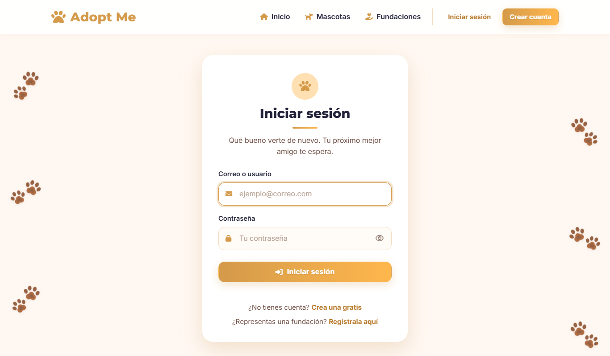
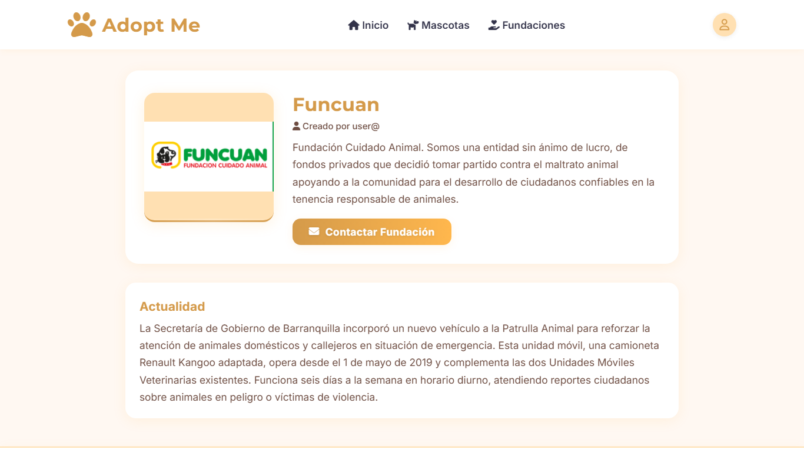
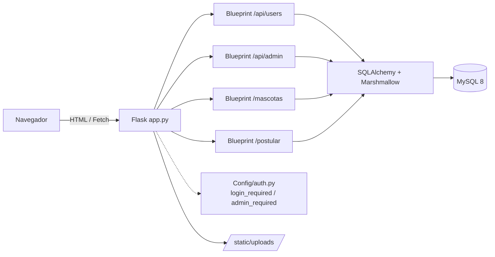
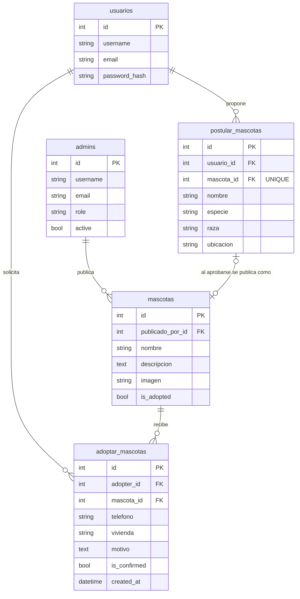

# 🐾 Adopt Me Now

**Plataforma web para conectar fundaciones de rescate animal con personas que quieren adoptar.**

[](https://github.com/IngGMunoz/Adopt-Me-Now/actions/workflows/tests.yml)


Las fundaciones publican las mascotas que tienen en adopción. Los usuarios las exploran, crean una cuenta y envían una solicitud de adopción que queda registrada para que la fundación la revise. Incluye un panel de administración con roles, una API REST y un asistente conversacional para resolver dudas sobre el proceso.

<p align="center">
  
  
  
  
</p>

---

## ✨ Funcionalidades

- **Catálogo de mascotas en adopción.** Las mascotas publicadas por los administradores aparecen automáticamente. Las ya adoptadas se ocultan.
- **Registro e inicio de sesión** con contraseñas cifradas (hash PBKDF2 de Werkzeug) y sesiones firmadas.
- **Solicitud de adopción.** Es un formulario con validación en cliente y servidor. Queda asociado al usuario y a la mascota elegida, y se envía sin recargar la página.
- **Panel de administración** para publicar mascotas con foto. La tarjeta aparece al instante.
- **Roles y permisos.** Usuario, administrador y superadministrador. La API de administración está protegida, y el registro de nuevos administradores exige un código de invitación.
- **Postulación de mascotas.** Un usuario puede proponer una mascota (especie, raza, edad, tamaño y ubicación) para que la fundación la revise.
- **API REST** para gestionar usuarios, administradores, mascotas y postulaciones, con serialización mediante Marshmallow.
- **Chatbot** (Landbot) integrado para orientar a los adoptantes.
- **Entorno reproducible** con Docker Compose (app + MySQL con healthcheck).
- **Tests automatizados** con pytest, ejecutados en GitHub Actions en cada push.

## 🛠️ Stack

| Capa | Tecnologías |
| --- | --- |
| Backend | Python 3.12, Flask 3, Blueprints |
| Datos | MySQL 8, SQLAlchemy (ORM), Marshmallow |
| Frontend | Jinja2, HTML5, CSS3, JavaScript (Fetch API), Font Awesome |
| Infraestructura | Docker, Docker Compose, variables de entorno (`.env`) |
| Calidad | pytest, GitHub Actions |

## 🧱 Arquitectura



El proyecto sigue un patrón MVC:

- **Modelos** (`Models/`): usuarios, administradores, mascotas, solicitudes de adopción y postulaciones.
- **Controladores** (`Config/controller/`): la API REST, organizada en Blueprints.
- **Vistas** (`Config/Templates/`): plantillas Jinja2 con un layout base y componentes reutilizables (navbar, footer, modales, notificaciones).

### Modelo de datos



**Flujo de datos:**

1. Un **admin** publica una **mascota**, o aprueba la **postulación** que envió un **usuario**. En ese caso la postulación queda enlazada a la mascota creada.
2. Un **usuario** envía una **solicitud de adopción** para una mascota.
3. El admin **confirma** la solicitud y la mascota queda marcada como adoptada, así que sale del catálogo.

Todas las llaves foráneas usan `ON DELETE SET NULL`: si se elimina un usuario o una mascota, el historial de solicitudes y postulaciones se conserva. Al iniciar, [`Config/schema.py`](Config/schema.py) migra automáticamente las bases MySQL de versiones anteriores. Agrega las columnas y las llaves foráneas que faltan, y enlaza los registros antiguos que guardaban nombres en texto.

## 🚀 Cómo ejecutarlo

### Opción 1: Docker (recomendada)

```bash
git clone https://github.com/IngGMunoz/Adopt-Me-Now.git
cd Adopt-Me-Now
cp .env.example .env        # edita las contraseñas y claves
docker compose up --build
```

La app queda en **http://localhost:5100**. MySQL se expone en el puerto `3307` del host.

### Opción 2: Local

Requiere Python 3.10+ y un servidor MySQL.

```bash
python -m venv .venv
source .venv/bin/activate      # Windows: .venv\Scripts\activate
pip install -r requirements.txt
cp .env.example .env           # ajusta DB_HOST, DB_PORT, DB_PASSWORD...
python app.py
```

Las tablas se crean solas al iniciar la aplicación.

### Crear el primer administrador

1. Define `ADMIN_REGISTRATION_CODE` en tu `.env`.
2. Entra a `/registro-administrador` y completa el formulario con ese código.
3. Inicia sesión: llegarás al panel `/postularADM` para publicar mascotas.

### Variables de entorno

| Variable | Descripción |
| --- | --- |
| `SECRET_KEY` | Clave para firmar las cookies de sesión |
| `ADMIN_REGISTRATION_CODE` | Código exigido para registrar administradores |
| `DB_HOST`, `DB_PORT`, `DB_USER`, `DB_PASSWORD`, `DB_NAME` | Conexión a MySQL |
| `DATABASE_URL` | URL completa de la base de datos (tiene prioridad sobre `DB_*`) |
| `FLASK_DEBUG` | `true` solo en desarrollo |
| `SESSION_COOKIE_SECURE` | `true` cuando la app se sirve por HTTPS |

## 🧪 Tests

```bash
pip install -r requirements-dev.txt
pytest -v
```

Los 36 tests usan una base SQLite temporal, así que no necesitan MySQL. Cubren:

- Registro, inicio de sesión y redirección segura (protección contra *open redirect*).
- Permisos por rol: acceso anónimo, de usuario y de administrador a cada endpoint protegido.
- Registro de administradores con código de invitación.
- Envío y validación de solicitudes de adopción.
- Publicación de mascotas con imagen y ocultamiento de las ya adoptadas.
- Relaciones del modelo: admin → mascota, usuario → solicitud → mascota, postulación → mascota aprobada, y conservación del historial al borrar registros.

## 🔌 API REST

| Método | Endpoint | Acceso | Descripción |
| --- | --- | --- | --- |
| `POST` | `/api/users/register` | Público | Crear cuenta |
| `POST` | `/api/users/login` | Público | Iniciar sesión |
| `POST` | `/api/users/logout` | Público | Cerrar sesión |
| `GET/PUT/DELETE` | `/api/users/<id>` | El propio usuario o un admin | Ver, editar o eliminar la cuenta |
| `GET` | `/mascotas/api` | Público | Listar mascotas |
| `POST` | `/api/admin/admins` | Admin o código de registro | Crear administrador |
| `GET/PUT/DELETE` | `/api/admin/admins/<id>` | Admin | Gestionar administradores |
| `GET/PUT/DELETE` | `/api/admin/users/<id>` | Admin | Gestionar usuarios |
| `GET/POST` | `/api/admin/mascotas` | Admin | Listar o publicar mascotas (JSON o multipart) |
| `POST` | `/api/admin/mascotas/<id>/adopt` | Admin | Marcar como adoptada |
| `GET/DELETE` | `/postular/<id>` | Admin | Revisar las mascotas propuestas por usuarios |
| `POST` | `/api/admin/postulares/<id>/aprobar` | Admin | Publicar la mascota propuesta y enlazarla a la postulación |
| `GET` | `/api/admin/solicitudes?mascota_id=` | Admin | Solicitudes de adopción con adoptante y mascota |
| `POST` | `/api/admin/solicitudes/<id>/confirmar` | Admin | Aprobar una solicitud (la mascota pasa a adoptada) |

## 🔒 Seguridad

- Contraseñas guardadas con hash, nunca en texto plano. Los schemas de la API excluyen `password_hash`.
- Decoradores `login_required` y `admin_required`. La API responde `401` o `403` en JSON y las páginas redirigen al login.
- Validación del parámetro `next` para evitar redirecciones a sitios externos.
- Las imágenes subidas se validan por extensión, se guardan con nombre único (UUID) y tienen un límite de 5 MB.
- El contenido que viene de usuarios se inserta en el DOM con `textContent`, nunca con `innerHTML`, para evitar XSS.
- Los secretos se leen de variables de entorno. `.env` está en `.gitignore`.
- Cookies de sesión `HttpOnly` y `SameSite=Lax`. El contenedor se ejecuta con un usuario sin privilegios.

## 📁 Estructura

```
Adopt-Me-Now/
├── app.py                  # Rutas de páginas y arranque de la app
├── Config/
│   ├── db.py               # Configuración de Flask, SQLAlchemy y variables de entorno
│   ├── auth.py             # Decoradores de permisos, redirección segura y subida de imágenes
│   ├── schema.py           # Creación y migración del esquema
│   ├── controller/         # Blueprints de la API REST
│   └── Templates/          # Vistas Jinja2 (layouts, components, main)
├── Models/                 # Modelos SQLAlchemy y schemas Marshmallow
├── static/                 # CSS, JS, imágenes y uploads
├── tests/                  # Suite de pytest
├── Dockerfile
└── docker-compose.yaml
```

## 🗺️ Próximos pasos

- [ ] Pantallas en el panel de administración para las solicitudes y postulaciones (la API ya existe).
- [ ] Notificaciones por correo al adoptante cuando cambie el estado de su solicitud.
- [ ] Filtros del catálogo por especie, tamaño y ubicación.
- [ ] Protección CSRF en formularios (Flask-WTF) y límite de intentos de inicio de sesión.
- [ ] Despliegue público con demo en vivo.

## 👤 Autor

**Daniel Utria**: diseño, frontend, backend e infraestructura.

- GitHub: [@IngGMunoz](https://github.com/IngGMunoz)
- LinkedIn:  linkedin.com/in/georgy-daniel-muñoz-utria


## 📄 Licencia

Distribuido bajo la licencia MIT. Ver [LICENSE](LICENSE).
